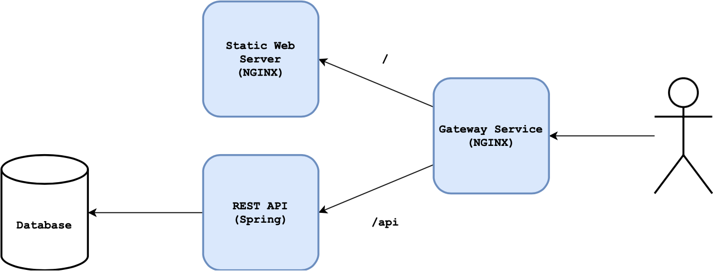

# Spring Boot App - Garage

An example of a full-stack Spring app that allows you to create, read, update and delete cars from a database. It has been kindly donated by [Glenn Etchells](https://github.com/Etchells) and updated slightly. You can find the original [here](https://github.com/Etchells/NatWest-Project).

## Task 1 – Containerise the App

Your task is to containerise this application with Docker and Docker Compose.

This is the app structure you should be aiming for:



Each service will require its own Dockerfile and you should write a `docker-compose.yaml` file to build/deploy the app.

Begin this task by forking this repository so you make your own changes to it. You'll know you've completed it when you can add/delete cars via the browser!

### Gateway

The *gateway* service is a simple NGINX reverse proxy.

The configuration for the NGINX service has been written for you and can be found at [`gateway/nginx.conf`](gateway/nginx.conf).

It has been set up to redirect all traffic to the frontend container *except*  requests to URLs that begin with `/api`.

This is because all `fetch` requests have been updated to begin with `/api`, as observed in [`frontend/js/crud.js`](frontend/js/crud.js).

### Frontend

The *frontend* service contains the static web files (HTML, CSS, JS) used to create the frontend of the application.

You should use an NGINX container to host these files. Any HTML/CSS/JS files copied into `/usr/share/nginx/html` on the container will be hosted by the NGINX container to be accessible via port 80. No further configuration is required.

>NOTE: When accessing the application, you will be prompted with a login page. Currently, there is no login functionality integrated into the application: simply click the **Sign In** button to proceed to the main application.

### Backend

The *backend* service contains the Spring application that handles database CRUD functions.

The application is set up to listen on port `9002`.

The database connection is configured in [`backend/src/main/resources/application-prod.properties`](backend/src/main/resources/application-prod.properties). It requires the following environment variables to be set:

| Environment Variable | Description                                       |
| ---------------------| ------------------------------------------------- |
| `MYSQL_SERVER`       | The URL endpoint for the MySQL server.            |
| `MYSQL_USER`         | The user used to connect to the MySQL server.     |
| `MYSQL_PASSWORD`     | The password used to connect to the MySQL server. |

Environment variables can be set on the command line with the `export` command, e.g.:

```bash
export MYSQL_SERVER=mydatabase.mysql.database.azure.com
```

Line 10 in [`backend/src/main/resources/application-prod.properties`](backend/src/main/resources/application-prod.properties) is defined as:

```java
spring.sql.init.mode=always
```

This will cause the database to be reinitialised every time the Spring app starts, causing all data to be wiped on the database. If you wish to disable this behaviour, set its value to `never`.

### Database

You should provision an Azure MySQL database for use with this application.

## Task 2 – Create a Deployment Pipeline

Once you have successfully containerised the application, create a fresh VM and install Jenkins on it.

You can use the [`jenkins/install-jenkins.sh`](jenkins/install-jenkins.sh) script to install Jenkins:

```bash
./jenkins/install-jenkins.sh
```

Then, create a pipeline job (configured using a Jenkinsfile) with the following stages:
    1. **Configure** – install dependencies (*Docker, Docker Compose*)
    2. **Build** – build the Docker images
    3. **Push** – push the Docker images
    4. **Deploy** – deploy the application

Stretch Goals:
- Push your images to a private Azure Container Registry.
- Set up a webhook to trigger the pipeline whenever a new push is made to the repository.
- Deploy the application to a server that is separate from the automation server.